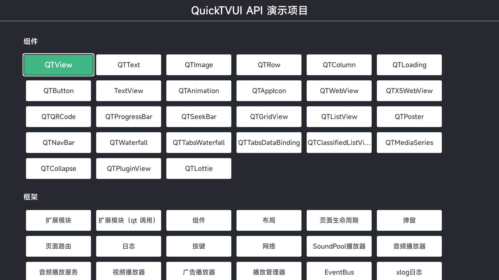

# [QuickTVUI](https://quicktvui.com/)
QuickTVUI的api-demo，方便快速了解组件及模块提供的能力


## 快速开始
### 调试
#### 1. 确认编译环境
建议windows:
- node version 16.20.2
- npm version 8.10

mac
- node version 17.0.1
- npm version 8.10

#### 2. 安装运行Runtime
下载并在设备上安装最新[Runtime](http://v3.quicktvui.com/zh/resource/runtime.html)
#### 3. 安装依赖
进入项目录下
```bash
npm install --legacy-peer-deps
```
#### 4. 编译调试
```bash
npm run dev
```
#### 5. 打开运行Runtime apk，查看效果
点击下图加载测试代码


关于adb等其它配置具体说明请查看 <u>[配置运行环境](https://quicktvui.com/zh-CN/guide/basic/quick-start.html) </u>

最后看到加载出页面，表示完成调试，即可随时修改源码查看效果。

更多信息请参考 [QuickTVUI](https://quicktvui.com/)
